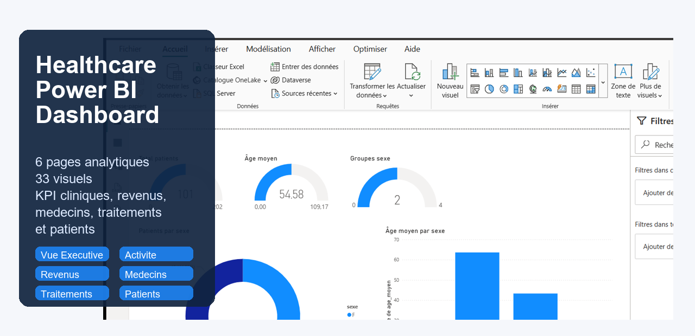
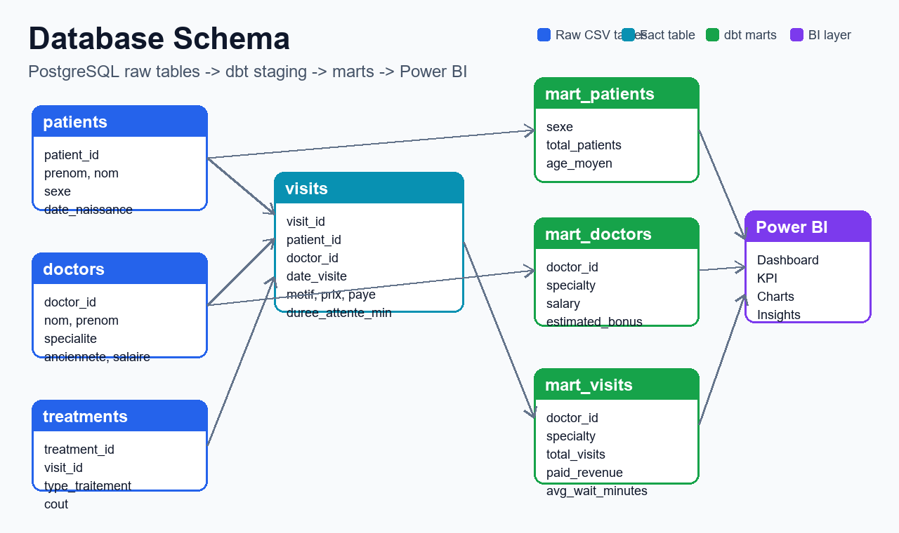
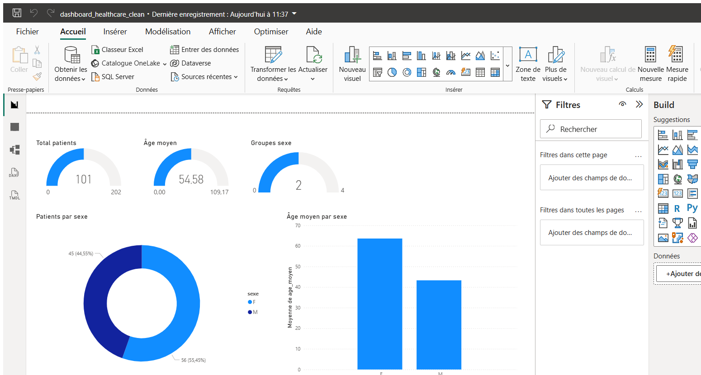

# Healthcare Data Stack

Projet de Modern Data Stack pour analyser des donnees de clinique : ingestion CSV, stockage PostgreSQL, transformations dbt et reporting Power BI.

## Dashboard Overview

Le rapport Power BI final est disponible ici : `powerbi/dashboard_healthcare_clean.pbix`. Il presente une vue synthetique des KPI cliniques, financiers et operationnels.

## Database Schema



Le modele relie les tables brutes `patients`, `doctors`, `visits` et `treatments` aux modeles dbt staging/marts, puis au rapport Power BI.

## Power BI Dashboard



Le dashboard contient 6 pages : Vue Executive, Activite Medicale, Revenus Paiements, Medecins Specialites, Traitements et Patients.

## Objectif

Le projet construit une chaine analytique complete :

1. Charger les fichiers CSV bruts dans PostgreSQL.
2. Transformer les donnees avec dbt en tables staging et marts.
3. Produire des KPI metier pour l'activite medicale, les revenus, les medecins, les patients et les traitements.
4. Visualiser les resultats dans Power BI.

## Stack technique

- Python : ingestion des fichiers CSV.
- PostgreSQL : base de donnees analytique locale.
- dbt : modelisation staging et marts.
- Power BI : dashboards et KPI.
- Docker Compose : lancement de PostgreSQL.

## Structure du projet

```text
healthcare-data-Stack/
├── data/                    # Fichiers CSV sources
├── dbt/                     # Projet dbt
│   └── models/
│       ├── staging/         # Modeles stg_*
│       └── marts/           # Tables marts et KPI
├── ingestion/               # Scripts Python de chargement CSV -> PostgreSQL
├── orchestration/           # Orchestration du pipeline
├── powerbi/                 # Rapport Power BI et documentation dashboard
├── docker-compose.yaml      # Service PostgreSQL
├── requirements.txt         # Dependances Python
└── README.md
```

## Donnees sources

Les fichiers CSV attendus sont dans `data/` :

- `patients.csv`
- `doctors.csv`
- `visits.csv`
- `treatments.csv`

## Installation

### 1. Cloner le projet

```bash
git clone <url-du-repository>
cd healthcare-data-Stack
```

### 2. Creer l'environnement Python

```bash
python -m venv venv
venv\Scripts\activate
pip install -r requirements.txt
```

Sur Linux/macOS :

```bash
source venv/bin/activate
pip install -r requirements.txt
```

### 3. Lancer PostgreSQL

```bash
docker compose up -d
```

La base creee par defaut est :

- Host : `localhost`
- Port : `5432`
- Database : `clinic_db`
- User : `data_user`
- Password : `password123`

### 4. Charger les donnees

```bash
python ingestion/load_data.py
python ingestion/load_dataD.py
python ingestion/load_dataV.py
python ingestion/load_dataT.py
```

Les scripts utilisent des chemins relatifs au projet, ce qui les rend utilisables apres clonage GitHub.

### 5. Executer dbt

```bash
cd dbt
dbt run
dbt test
```

## Modelisation dbt

### Staging

- `stg_patients` : nettoyage patients et calcul de l'age.
- `stg_doctors` : normalisation des champs medecins.
- `stg_visits` : typage des visites, prix, paiement et attente.
- `stg_treatments` : typage des traitements.

### Marts et KPI

- `mart_patients` : patients par sexe et age moyen.
- `mart_doctors` : medecins enrichis avec bonus estime.
- `mart_visits` : activite par medecin et specialite.
- `kpi_revenue_by_doctor` : revenus payes par medecin/specialite.
- `kpi_patient2` : indicateurs patients complementaires.

## Power BI

Le nouveau rapport propre est :

```text
powerbi/dashboard_healthcare_clean.pbix
```

Il contient 6 pages :

1. `01 Vue Executive`
2. `02 Activite Medicale`
3. `03 Revenus Paiements`
4. `04 Medecins Specialites`
5. `05 Traitements`
6. `06 Patients`

Documentation Power BI :

- `powerbi/DASHBOARDS_A_CREER.md`
- `powerbi/MESURES_DAX.md`

## KPI principaux

- Total visites
- Total patients
- Total medecins
- Chiffre d'affaires total
- Taux de paiement
- Attente moyenne
- Cout total des traitements
- Revenus par specialite
- Revenus par medecin
- Patients par sexe

## Preparation GitHub

Les dossiers generes localement ne doivent pas etre versionnes :

- `dbt/target/`
- `dbt/logs/`
- `logs/`
- caches Python
- fichiers temporaires Power BI

Le fichier Power BI final `powerbi/dashboard_healthcare_clean.pbix` est conserve dans le repository car il fait partie du livrable BI.

## Auteur

Ahmed Fadili - Data & Analytics
